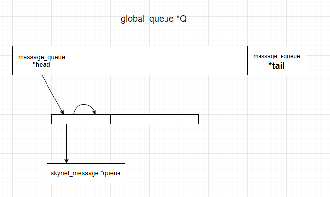

上一节总结了main函数里的代码都做了些啥事。

- skynet 启动需要指定一个配置文件，main中会把配置文件里的 `$var` 替换成系统的环境变量，并且会把配置文件内的键值对设置到 `skynet_env E` `E->L` 的lua虚拟机的全局环境中。
- 创建了一个全局节点 `skynet_node G_NODE`, 并把当前工作线程的状态由 `THREAD_MAIN` 改为 `THREAD_WORKER`
- 设置当前进程忽略 SIGPIPE 信号。
- 初始化 `codecache CC`
- 初始化 `skynet_config config` 配置信息，传到 `skynet_start(&config)` 内。

这一节继续，skynet_start, 完整的函数先贴出来。

```c
void 
skynet_start(struct skynet_config * config) {
    // register SIGHUP for log file reopen
    struct sigaction sa;
    sa.sa_handler = &handle_hup;
    sa.sa_flags = SA_RESTART;
    sigfillset(&sa.sa_mask);
    sigaction(SIGHUP, &sa, NULL);

    if (config->daemon) {
        if (daemon_init(config->daemon)) {
            exit(1);
        }
    }
    skynet_harbor_init(config->harbor);
    skynet_handle_init(config->harbor);
    skynet_mq_init();
    skynet_module_init(config->module_path);
    skynet_timer_init();
    skynet_socket_init();
    skynet_profile_enable(config->profile);

    struct skynet_context *ctx = skynet_context_new(config->logservice, config->logger);
    if (ctx == NULL) {
        fprintf(stderr, "Can't launch %s service\n", config->logservice);
        exit(1);
    }

    skynet_handle_namehandle(skynet_context_handle(ctx), "logger");

    bootstrap(ctx, config->bootstrap);

    start(config->thread);

    // harbor_exit may call socket send, so it should exit before socket_free
    skynet_harbor_exit();
    skynet_socket_free();
    if (config->daemon) {
        daemon_exit(config->daemon);
    }
}
```

---------------------------

```c
struct sigaction sa;
sa.sa_handler = &handle_hup;
sa.sa_flags = SA_RESTART;
sigfillset(&sa.sa_mask);
sigaction(SIGHUP, &sa, NULL);
```

SIGHUP 信号重新注册了一个handle, 如果收到 SIGHUP 信号，将调用 handle_hup 函数，将把 SIG 置为1，SIG 定义为 `static volatile int SIG = 0;` 


----------------------------

```c
if (config->daemon) {
    if (daemon_init(config->daemon)) {
        exit(1);
    }
}
```

如果函数 daemon_init 返回值判断为true，则退出当前进程。

我们看看 daemon_init 里做了些什么事。

```c
// skynet-src/skynet-deamon.c
int
daemon_init(const char *pidfile) {
    int pid = check_pid(pidfile);

    if (pid) {
        fprintf(stderr, "Skynet is already running, pid = %d.\n", pid);
        return 1;
    }

#ifdef __APPLE__
    fprintf(stderr, "'daemon' is deprecated: first deprecated in OS X 10.5 , use launchd instead.\n");
#else
    if (daemon(1,1)) {
        fprintf(stderr, "Can't daemonize.\n");
        return 1;
    }
#endif

    pid = write_pid(pidfile);
    if (pid == 0) {
        return 1;
    }

    if (redirect_fds()) {
        return 1;
    }

    return 0;
}
```

首先是 check_pid()

```c
static int
check_pid(const char *pidfile) {
    int pid = 0;
    FILE *f = fopen(pidfile,"r");
    if (f == NULL)
        return 0;
    int n = fscanf(f,"%d", &pid);
    fclose(f);

    if (n !=1 || pid == 0 || pid == getpid()) {
        return 0;
    }

    if (kill(pid, 0) && errno == ESRCH)
        return 0;

    return pid;
}
```

从文件中读取一个数字，赋值给 pid, 

`kill(pid, 0) && errno == ESRCH` 向进程号为 pid 的进程发送一个信号 0，用于检查进程是否存在，如果错误信息为 ESRCH，代表进程不存在，return 0， 否则返回pid。

如果 pid 不为 0，说明 pid 的进程存在，输出 "Skynet is already running, pid = ", skynet 进程退出。

说明，在配置文件里配置 deamon 文件路径，是为了防止 skynet 再启动同一个配置。


下面回到 daemon_init

```c
#ifdef __APPLE__
    fprintf(stderr, "'daemon' is deprecated: first deprecated in OS X 10.5 , use launchd instead.\n");
#else
    if (daemon(1,1)) {
        fprintf(stderr, "Can't daemonize.\n");
        return 1;
    }
#endif
```

如果是苹果设备，输出提示，守护进程在 OX 系统被弃用了，否则设置把当前进程设置为守护进行。

下面是对 `daemon` 的一段介绍。

```c
#include <unistd.h>
int daemon(int nochdir,int noclose);

// nochdir 参数用于指定是否改变工作目录，如果给它传递0，则工作目录将被设置为“/”（根目录），否则继续使用当前工作目录。
// noclose 参数为0时，标准输入、标准输出和标准错误输出都被重定向到/dev/null文件，否则依然使用原来的设备。该函数成功时返回0，失败返回-1,并设置errno。
```

```c
pid = write_pid(pidfile);
if (pid == 0) {
    return 1;
}
```

将当前进程的pid写入文件，理所应当嘛，配置文件配了 daemon 的话，第一次启动要把进程号给记下来，下一次尝试启动就检查不过了。

daemon_init 最后还做了一件事，重定向文件描述符，把当前进程的文件描述符 0，1，2，也就是 标准输入、标准输出、标准错误输出全部重定向到 nfd, nfd 对应文件 "/dev/null"。

> 维基百科 /dev/null
    /dev/null（或称空设备）在类Unix系统中是一个特殊的设备文件，它丢弃一切写入其中的数据（但报告写入操作成功），读取它则会立即得到一个EOF

```c
if (redirect_fds()) {
    return 1;
}

static int
redirect_fds() {
    int nfd = open("/dev/null", O_RDWR);
    if (nfd == -1) {
        perror("Unable to open /dev/null: ");
        return -1;
    }
    if (dup2(nfd, 0) < 0) {
        perror("Unable to dup2 stdin(0): ");
        return -1;
    }
    if (dup2(nfd, 1) < 0) {
        perror("Unable to dup2 stdout(1): ");
        return -1;
    }
    if (dup2(nfd, 2) < 0) {
        perror("Unable to dup2 stderr(2): ");
        return -1;
    }

    close(nfd);

    return 0;
}
```

daemon_init 到这里就结束了，总结一下 daemon_init 做了哪些事，检查文件里的 pid 进程号，如果存在说明这个配置文件已经被启动过了，则不允许被再次启动为skynet进程，

将当前进程设置为守护进程。

如果是第一次启动则把 pid 号写入文件，用做下次尝试启动时的检查，

重定向文件描述符，丢弃标准输入，标准输出，标准错误文件的数据。

如果这些都满足了，return 0


-------------------------------------------------------------------


继续回到 skynet_start 函数。

<strong>skynet_harbor_init(config->harbor);</strong>

```c
// skynet-src/skynet_harbor.c
static unsigned int HARBOR = ~0;
void
skynet_harbor_init(int harbor) {
    HARBOR = (unsigned int)harbor << HANDLE_REMOTE_SHIFT;
}

// skynet-src/skynet_handle.h
// #define HANDLE_REMOTE_SHIFT 24
HANDLE_REMOTE_SHIFT
```

把配置文件内的 `harbor << 24`位 赋值给 HARBOR，暂时先不管有什么用。


----------------------------------------------------------------

<strong>skynet_handle_init(config->harbor);</strong>

```c
void 
skynet_handle_init(int harbor) {
    assert(H==NULL);
    struct handle_storage * s = skynet_malloc(sizeof(*H));
    s->slot_size = DEFAULT_SLOT_SIZE;
    s->slot = skynet_malloc(s->slot_size * sizeof(struct skynet_context *));
    memset(s->slot, 0, s->slot_size * sizeof(struct skynet_context *));

    rwlock_init(&s->lock);
    // reserve 0 for system
    s->harbor = (uint32_t) (harbor & 0xff) << HANDLE_REMOTE_SHIFT;
    s->handle_index = 1;
    s->name_cap = 2;
    s->name_count = 0;
    s->name = skynet_malloc(s->name_cap * sizeof(struct handle_name));

    H = s;

    // Don't need to free H
}
```

H的定义:

```c
// skynet-scr/skynet_handle.c
static struct handle_storage *H = NULL;
```

handle_storage 的定义

```c
// skynet-scr/skynet_handle.c
struct handle_storage {
    struct rwlock lock;

    uint32_t harbor;
    uint32_t handle_index;
    int slot_size;
    struct skynet_context ** slot;
    
    int name_cap;
    int name_count;
    struct handle_name *name;
};

struct handle_name {
    char * name;
    uint32_t handle;
};
```


```c
// skynet-scr/skynet_handle.c
#define DEFAULT_SLOT_SIZE 4
#define MAX_SLOT_SIZE 0x40000000
```

skynet_handle_init 函数声明了一个 handle_storage 结构体赋值给了H,

handle_storage 包含一个读写锁，一个harbor，harbor_index, 

slot_size 默认设置为 4，指定 skynet_context 结构体指针的二级指针 slot

name_cap, name_count, 指向 handle_name 结构体对象的指针。


```c
// reserve 0 for system
s->harbor = (uint32_t) (harbor & 0xff) << HANDLE_REMOTE_SHIFT;
```

从这里可以看出，harbor 不能为 0，系统保留，harbor 最大为 0xff, 也就是255, 之后再左移 HANDLE_REMOTE_SHIFT，24位，和 skynet-src/skynet_harbor.c 里的HARBOR 保持一致。


```c
rwlock_init(&s->lock);

struct rwlock {
    ATOM_INT write;
    ATOM_INT read;
};

static inline void
rwlock_init(struct rwlock *lock) {
    ATOM_INIT(&lock->write, 0);
    ATOM_INIT(&lock->read, 0);
}
```

原子操作的读写锁。


-----------------------------------------------------------------------------------


<strong>skynet_mq_init();</strong>


```c
// skynet-src/skynet_mq.c
void 
skynet_mq_init() {
    struct global_queue *q = skynet_malloc(sizeof(*q));
    memset(q,0,sizeof(*q));
    SPIN_INIT(q);
    Q=q;
}
```

```c
// skynet-src/skynet_mq.c

struct global_queue {
    struct message_queue *head;
    struct message_queue *tail;
    struct spinlock lock;
};

static struct global_queue *Q = NULL;
```

定义了一个全局的消息队列 Q，包含一个 head 指针，tail指针，一个spinlock 自旋锁 lock。

头尾指针指向的也是一个消息队列，我们暂时称之为子消息队列，子消息队列表示的是某个具体的 handle 所要处理的消息所组成的队列。

```c
struct message_queue {
    struct spinlock lock;
    uint32_t handle;
    int cap;
    int head;
    int tail;
    int release;
    int in_global;
    int overload;
    int overload_threshold;
    struct skynet_message *queue;
    struct message_queue *next;
};

struct skynet_message {
    uint32_t source;
    int session;
    void * data;
    size_t sz;
};
```

示意图大概是这样：




------------------------------------------------------
<strong>skynet_module_init(config->module_path);</strong>

```c
void 
skynet_module_init(const char *path) {
    struct modules *m = skynet_malloc(sizeof(*m));
    m->count = 0;
    m->path = skynet_strdup(path);

    SPIN_INIT(m)

    M = m;
}
```

```c
struct skynet_module {
    const char * name;
    void * module;
    skynet_dl_create create;
    skynet_dl_init init;
    skynet_dl_release release;
    skynet_dl_signal signal;
};

struct modules {
    int count;
    struct spinlock lock;
    const char * path;
    struct skynet_module m[MAX_MODULE_TYPE];
};

static struct modules * M = NULL;
```

skynet-src/skynet_module.c 内声明了一个 modules 的结构体对象M, 对 M进行了初始化。

`m->path = skynet_strdup(path);` 这里的path 也就是 `config->module_path`, 在main 函数内赋值，`config.module_path = optstring("cpath","./cservice/?.so");`，就是配置文件里的 cpath 配置。

```c
char *
skynet_strdup(const char *str) {
    size_t sz = strlen(str);
    char * ret = skynet_malloc(sz+1);
    memcpy(ret, str, sz+1);
    return ret;
}
```

我们可以看到，skynet_strdup 的作用是将字符串 copy 了一份。

这里插个题外话，为什么函数命名为 skynet_strdup，还记得上面的赋值文件描述符的系统调用函数名吗，dup 和 dup2，现在是不是理解了。

modules 内还声明了一个 skynet_module 类型的数组，`struct skynet_module m[MAX_MODULE_TYPE];`


----------------------------------------------------------

<strong>skynet_timer_init();</strong>

```c
static struct timer * TI = NULL;
void 
skynet_timer_init(void) {
    TI = timer_create_timer();
    uint32_t current = 0;
    systime(&TI->starttime, &current);
    TI->current = current;
    TI->current_point = gettime();
}
```

创建了一个 timer, 把 TI->starttime 的值赋为系统现实时间的秒数，TI->current 的值赋为系统现实时间秒数的100倍（只是时间小数点后面的时间），TI->current_point 的值赋为当前系统启动时间的秒数的100倍。

```c
static void
systime(uint32_t *sec, uint32_t *cs) {
    struct timespec ti;
    clock_gettime(CLOCK_REALTIME, &ti);
    *sec = (uint32_t)ti.tv_sec;
    *cs = (uint32_t)(ti.tv_nsec / 10000000);
}

static uint64_t
gettime() {
    uint64_t t;
    struct timespec ti;
    clock_gettime(CLOCK_MONOTONIC, &ti);
    t = (uint64_t)ti.tv_sec * 100;
    t += ti.tv_nsec / 10000000;
    return t;
}
```

这里主要是对 TI 进行了初始化，暂时不细究，以后出专题研究它。

CLOCK_REALTIME，CLOCK_MONOTONIC 的 区别可以看看参考博客: 

https://www.cnblogs.com/book-gary/p/3716790.html   
https://blog.csdn.net/tangchenchan/article/details/47989473


----------------------------------------------------------------------------
<strong>skynet_socket_init</strong>

```c
void 
skynet_socket_init() {
    SOCKET_SERVER = socket_server_create(skynet_now());
}
```

看函数名知道创建了一个 socket_server，暂时不细究，估计要出专题。


------------------------------------------------------------------------

<strong>skynet_profile_enable(config->profile);</strong>

```c
void
skynet_profile_enable(int enable) {
    G_NODE.profile = (bool)enable;
}
```

通过配置文件设置 profile 是开还是关。


skynet_start() 上半段暂时看到这里，后面才是重头戏呀。


