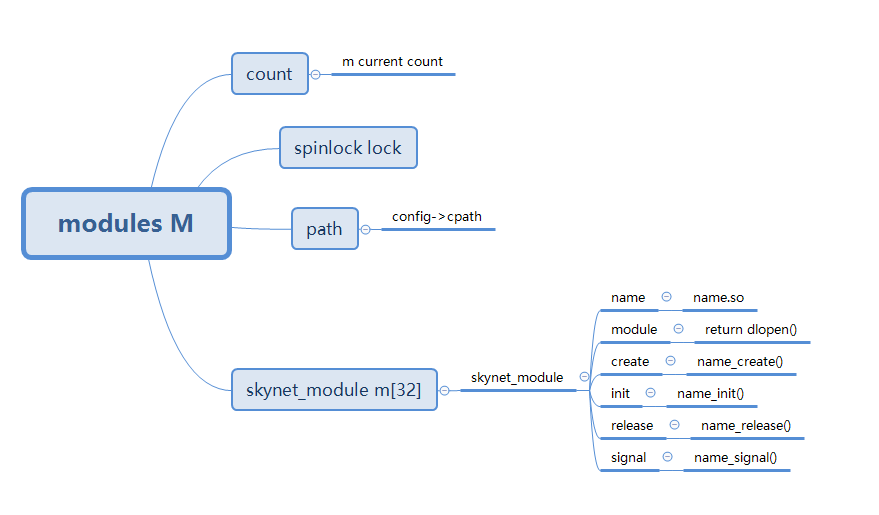

上一节看了skynet_start() 的一部分代码，那部分代码主要做了下面几件事。

- 如果当前进程收到 SIGHUP 信号，则调用 handle_hup 函数，将 SIG 设为 1
- 检查配置文件内的 deamon 配置，这个配置对应一个文件路径，文件内的记录进程的pid号，防止重复启动skynet进程，第一次启动将自动将进程号写入文件。
- 重定向了文件描述符，把文件描述符0，1，2 重定向到了  /dev/null，相当于当前进程忽略了标准输入，标准输出，标准错误。
- 初始化了 HARBOR 的值，HARBOR的值为配置文件内 harbor 配置的值左移 24位。
- 初始化了一个 handle_storage 结构体，结构体内包含一个 harbor 成员，其中限定了 harbor 最高为 0xff, 也就是 (2^8)-1, 所以 harbor 的取值在 1-255 之间，之后再左移 24 位，和 HARBOR 保持一致。
- 初始化了一个全局消息队列，全局消息队列里的每一个元素都是一个子消息队列，其中子消息队列的元素内包含具体的消息。
- 初始化了一个 modules 结构体 M，结构体内包含一个 path 成员，保存着配置文件内的 cpath 配置，一个 skynet_module 类型的数组 m, 数组长度为 32。
- 初始化了定时器模块，暂时不细节功能实现，但是我们知道模块里定时器的时间单位是 1 / 100 秒。
- 初始化了 socket 模块，暂时不细节，不影响我们捋顺框架。
- 把配置文件的 profile 配置保存在 G_NODE 中。

以上就是 skynet_start() 前半段代码做的一些事了。

今天的内容主要梳理了一下 `skynet_context_new` 这个函数都做了什么。

接着 skynet_start() 的内容看: 

```c
struct skynet_context *ctx = skynet_context_new(config->logservice, config->logger);
if (ctx == NULL) {
    fprintf(stderr, "Can't launch %s service\n", config->logservice);
    exit(1);
}
```

可以看到，这段代码无非是尝试去创建一个 skynet_context 结构体。

如果创建失败了，整个进程就退出了。

下面我们看看 skynet_context_new() 函数。

```c
struct skynet_context * 
skynet_context_new(const char * name, const char *param) {
    struct skynet_module * mod = skynet_module_query(name);

    if (mod == NULL)
        return NULL;

    void *inst = skynet_module_instance_create(mod);
    if (inst == NULL)
        return NULL;
    struct skynet_context * ctx = skynet_malloc(sizeof(*ctx));
    CHECKCALLING_INIT(ctx)

    ctx->mod = mod;
    ctx->instance = inst;
    ATOM_INIT(&ctx->ref , 2);
    ctx->cb = NULL;
    ctx->cb_ud = NULL;
    ctx->session_id = 0;
    ATOM_INIT(&ctx->logfile, (uintptr_t)NULL);

    ctx->init = false;
    ctx->endless = false;

    ctx->cpu_cost = 0;
    ctx->cpu_start = 0;
    ctx->message_count = 0;
    ctx->profile = G_NODE.profile;
    // Should set to 0 first to avoid skynet_handle_retireall get an uninitialized handle
    ctx->handle = 0;    
    ctx->handle = skynet_handle_register(ctx);
    struct message_queue * queue = ctx->queue = skynet_mq_create(ctx->handle);
    // init function maybe use ctx->handle, so it must init at last
    context_inc();

    CHECKCALLING_BEGIN(ctx)
    int r = skynet_module_instance_init(mod, inst, ctx, param);
    CHECKCALLING_END(ctx)
    if (r == 0) {
        struct skynet_context * ret = skynet_context_release(ctx);
        if (ret) {
            ctx->init = true;
        }
        skynet_globalmq_push(queue);
        if (ret) {
            skynet_error(ret, "LAUNCH %s %s", name, param ? param : "");
        }
        return ret;
    } else {
        skynet_error(ctx, "FAILED launch %s", name);
        uint32_t handle = ctx->handle;
        skynet_context_release(ctx);
        skynet_handle_retire(handle);
        struct drop_t d = { handle };
        skynet_mq_release(queue, drop_message, &d);
        return NULL;
    }
}
```

好长...

不急，我们一点点看。

```c
struct skynet_module * mod = skynet_module_query(name);

if (mod == NULL)
    return NULL;
```

查询 name 表示的模块，如果没查到，就 `return NULL`

```c
struct skynet_module * 
skynet_module_query(const char * name) {
    struct skynet_module * result = _query(name);
    if (result)
        return result;

    SPIN_LOCK(M)

    result = _query(name); // double check

    if (result == NULL && M->count < MAX_MODULE_TYPE) {
        int index = M->count;
        void * dl = _try_open(M,name);
        if (dl) {
            M->m[index].name = name;
            M->m[index].module = dl;

            if (open_sym(&M->m[index]) == 0) {
                M->m[index].name = skynet_strdup(name);
                M->count ++;
                result = &M->m[index];
            }
        }
    }

    SPIN_UNLOCK(M)

    return result;
}
```

skynet_module_query: 调用 `_query()` 查找，查到了直接返回。

```c
static struct skynet_module * 
_query(const char * name) {
    int i;
    for (i=0;i<M->count;i++) {
        if (strcmp(M->m[i].name,name)==0) {
            return &M->m[i];
        }
    }
    return NULL;
}
```

从之前初始化好的 `modules M`结构体内的数组中查找，如果在数组内返回。

如果不在数组内，skynet_module_query() 将尝试打开 name 文件。

```c
static void *
_try_open(struct modules *m, const char * name) {
    const char *l;
    const char * path = m->path;
    size_t path_size = strlen(path);
    size_t name_size = strlen(name);

    int sz = path_size + name_size;
    //search path
    void * dl = NULL;
    char tmp[sz];
    do
    {
        memset(tmp,0,sz);
        while (*path == ';') path++;
        if (*path == '\0') break;
        l = strchr(path, ';');
        if (l == NULL) l = path + strlen(path);
        int len = l - path;
        int i;
        for (i=0;path[i]!='?' && i < len ;i++) {
            tmp[i] = path[i];
        }
        memcpy(tmp+i,name,name_size);
        if (path[i] == '?') {
            strncpy(tmp+i+name_size,path+i+1,len - i - 1);
        } else {
            fprintf(stderr,"Invalid C service path\n");
            exit(1);
        }
        dl = dlopen(tmp, RTLD_NOW | RTLD_GLOBAL);
        path = l;
    }while(dl == NULL);

    if (dl == NULL) {
        fprintf(stderr, "try open %s failed : %s\n",name,dlerror());
    }

    return dl;
}
```

我们可以看到 `_try_open()` 函数一直从 path（对应配置文件的cpath）中的路径进行尝试，并将 `?` 替换为 name，也就是传入的文件名，尝试打开文件，如果 dl 不为 NULL，则说明找到了该文件，跳出循环之后还没找到则不在 cpath 里。

不能理解上面的话可以看这里: 

一般我们在配置文件配填 cpath 的配置是这样的

```lua
root = "./"
cpath = root .."cservice/?.so;" .. root .. "xxx/?.so"
```

这段config 的lua代码会在 main函数内被执行一次，所以 cpath 的值将变成 `./cservice/?.so;./xxx/?.so`, 假如我们的 `name = log`

`_try_open()` 就是把cpath里的 `?` 替换成log，再以 `;` 为分隔符分割，得到 `./cservice/log.so`, `./xxx/log.so`。

然后再传入 `dlopen()`，尝试打开动态链接库。


```c
int index = M->count;
void * dl = _try_open(M,name);
if (dl) {
    M->m[index].name = name;
    M->m[index].module = dl;

    if (open_sym(&M->m[index]) == 0) {
        M->m[index].name = skynet_strdup(name);
        M->count ++;
        result = &M->m[index];
    }
}
```

我们再回到 `skynet_module_query()`，正常打开之后把相关的信息保存在 `modules M`, `M->m`, skynet_module 类型的数组里。

```c
struct skynet_module {
    const char * name;
    void * module;
    skynet_dl_create create;
    skynet_dl_init init;
    skynet_dl_release release;
    skynet_dl_signal signal;
};
```

- name: 文件名
- module: dlopen 打开的链接库句柄
- create: name 文件内的 `{%s}_create, name` 函数指针。
- init: name 文件内的 `{%s}_init, name` 函数指针。
- release: name 文件内的 `{%s}_release, name` 函数指针。
- signal: name 文件内的 `{%s}_signal, name` 函数指针。

所以我们写C服务时应包含 create, init, release, signal 四个函数，这四个函数的函数名应加上 `文件名_`作为前缀。

小结一下就是 `skynet_module_query()` 函数会从 M 中查找对应的 skynet_module 结构体对象，如果找到了直接返回，没找到就从配置文件里 cpath 路径找对应的文件，如果找到了加载到内存中，并保存到 M 里，下次就不用重复打开了，返回对象。


画了个简单的图可以参考下:



---------------------------------

下面我们继续回到 `skynet_context_new()` 里。

```c
void *inst = skynet_module_instance_create(mod);
if (inst == NULL)
    return NULL;
```

```c
void * 
skynet_module_instance_create(struct skynet_module *m) {
    if (m->create) {
        return m->create();
    } else {
        return (void *)(intptr_t)(~0);
    }
}
```

返回这个 c模块里相应的create 函数返回值，否则返回  `(void *)(intptr_t)(~0)`。

----------------------------------------

```c
struct skynet_context * ctx = skynet_malloc(sizeof(*ctx));
CHECKCALLING_INIT(ctx)
```

```c
struct skynet_context {
    void * instance;
    struct skynet_module * mod;
    void * cb_ud;
    skynet_cb cb;
    struct message_queue *queue;
    ATOM_POINTER logfile;
    uint64_t cpu_cost;  // in microsec
    uint64_t cpu_start; // in microsec
    char result[32];
    uint32_t handle;
    int session_id;
    ATOM_INT ref;
    int message_count;
    bool init;
    bool endless;
    bool profile;

    CHECKCALLING_DECL
};

#define CHECKCALLING_INIT(ctx)
```

创建了一个 skynet_context 结构体 ctx。

----------------------------------------------------

```c
ctx->mod = mod;
ctx->instance = inst;
ATOM_INIT(&ctx->ref , 2);
ctx->cb = NULL;
ctx->cb_ud = NULL;
ctx->session_id = 0;
ATOM_INIT(&ctx->logfile, (uintptr_t)NULL);

ctx->init = false;
ctx->endless = false;

ctx->cpu_cost = 0;
ctx->cpu_start = 0;
ctx->message_count = 0;
ctx->profile = G_NODE.profile;
```

初始化了一些信息。

```c
// Should set to 0 first to avoid skynet_handle_retireall get an uninitialized handle
ctx->handle = 0;
ctx->handle = skynet_handle_register(ctx);
```

```c
uint32_t
skynet_handle_register(struct skynet_context *ctx) {
    struct handle_storage *s = H;

    rwlock_wlock(&s->lock);
    
    for (;;) {
        int i;
        uint32_t handle = s->handle_index;
        for (i=0;i<s->slot_size;i++,handle++) {
            if (handle > HANDLE_MASK) {
                // 0 is reserved
                handle = 1;
            }
            int hash = handle & (s->slot_size-1);
            if (s->slot[hash] == NULL) {
                s->slot[hash] = ctx;
                s->handle_index = handle + 1;

                rwlock_wunlock(&s->lock);

                handle |= s->harbor;
                return handle;
            }
        }
        assert((s->slot_size*2 - 1) <= HANDLE_MASK);
        struct skynet_context ** new_slot = skynet_malloc(s->slot_size * 2 * sizeof(struct skynet_context *));
        memset(new_slot, 0, s->slot_size * 2 * sizeof(struct skynet_context *));
        for (i=0;i<s->slot_size;i++) {
            int hash = skynet_context_handle(s->slot[i]) & (s->slot_size * 2 - 1);
            assert(new_slot[hash] == NULL);
            new_slot[hash] = s->slot[i];
        }
        skynet_free(s->slot);
        s->slot = new_slot;
        s->slot_size *= 2;
    }
}
```

之前在 skynet_handle.c 中声明过一个 handle_storage* H, 其中包括 harbor, 现在用到了其中的  handle_index, slot_size, slot;

slot 的类型为 `skynet_context**` ，ctx 为 `skynet_context*`, 之前为 slot 申请了 slot_size 个 `skynet_context*` 大小的内存，所以 slot 内可以放 slot_size 个指针。

`skynet_handle_register()` 实现了以下功能，从 slot 中找到一个位置存 ctx, 其中位置 0是保留的，如果找到了，直接返回，则下次找的时候从当前位置的下一个位置找，handle_index 存的是下次开始找的位置。 
如果没找到，则申请别原来多一倍的空间啊，再把所有的元素重新hash，重新保存到new_slot里，释放原来的空间，最外层for循环再执行一次，这次肯定就能有位置放了。

其实通过 handle 就可以找到 ctx的下标了，hash = handle & (s->slot_size - 1)

```c
handle |= s->harbor;
return handle;
```
最后返回handle, 注意这里的 `|=`


--------------------------------------------

```c
struct message_queue * queue = ctx->queue = skynet_mq_create(ctx->handle);
// init function maybe use ctx->handle, so it must init at last
context_inc();
```

```c
struct message_queue * 
skynet_mq_create(uint32_t handle) {
    struct message_queue *q = skynet_malloc(sizeof(*q));
    q->handle = handle;
    q->cap = DEFAULT_QUEUE_SIZE;
    q->head = 0;
    q->tail = 0;
    SPIN_INIT(q)
    // When the queue is create (always between service create and service init) ,
    // set in_global flag to avoid push it to global queue .
    // If the service init success, skynet_context_new will call skynet_mq_push to push it to global queue.
    q->in_global = MQ_IN_GLOBAL;
    q->release = 0;
    q->overload = 0;
    q->overload_threshold = MQ_OVERLOAD;
    q->queue = skynet_malloc(sizeof(struct skynet_message) * q->cap);
    q->next = NULL;

    return q;
}
```

创建一个消息队列，初始化

- handle: 处理这个消息的handle
- cap: 消息队列的 capcity 容量
- head, tail: 头尾指针
- in_global: 是否在全局消息队列里
- release: 是否析构了
- overload: 是否过载
- overload_threshold: 过载阈值
- queue: 当前消息队列中消息指针
- next: 全局消息队列中下一个消息队列的指针


-----------------------------------------

```c
context_inc();

static void
context_inc() {
    ATOM_FINC(&G_NODE.total);
}
```

初始化 G_NODE.total, 原子类型。

-------------------------------------

```c
CHECKCALLING_BEGIN(ctx)
int r = skynet_module_instance_init(mod, inst, ctx, param);
CHECKCALLING_END(ctx)

int
skynet_module_instance_init(struct skynet_module *m, void * inst, struct skynet_context *ctx, const char * parm) {
    return m->init(inst, ctx, parm);
}
```

这里调用 c 模块的 init 函数，这里的话也就是 "logger_init"。

```c
int
logger_init(struct logger * inst, struct skynet_context *ctx, const char * parm) {
    const char * r = skynet_command(ctx, "STARTTIME", NULL);
    inst->starttime = strtoul(r, NULL, 10);
    if (parm) {
        inst->handle = fopen(parm,"a");
        if (inst->handle == NULL) {
            return 1;
        }
        inst->filename = skynet_malloc(strlen(parm)+1);
        strcpy(inst->filename, parm);
        inst->close = 1;
    } else {
        inst->handle = stdout;
    }
    if (inst->handle) {
        skynet_callback(ctx, inst, logger_cb);
        return 0;
    }
    return 1;
}
```

我们可以看到，如果 parm 存在，也就是 config->logger 存在，对应配置文件的 logger 字段，如果存在，则追加输出到文件内，否则输出到 stdout。


```c
if (r == 0) {
    struct skynet_context * ret = skynet_context_release(ctx);
    if (ret) {
        ctx->init = true;
    }
    skynet_globalmq_push(queue);
    if (ret) {
        skynet_error(ret, "LAUNCH %s %s", name, param ? param : "");
    }
    return ret;
} else {
    skynet_error(ctx, "FAILED launch %s", name);
    uint32_t handle = ctx->handle;
    skynet_context_release(ctx);
    skynet_handle_retire(handle);
    struct drop_t d = { handle };
    skynet_mq_release(queue, drop_message, &d);
    return NULL;
}
```

如果初始化成功，则将消息队列push到全局消息队列，否则进行析构操作。

